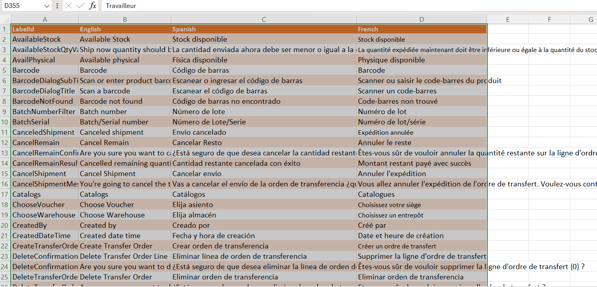

# JSON to Excel Converter (json2excel)

**Version:** 1.0.0  
**Author:** Daggiana Madrid  
**License:** ISC

## Description

JSON to Excel Converter (json2excel) is a versatile tool designed to streamline the process of converting JSON data into Excel spreadsheets effortlessly.  
Whether you are working with complex data structures or simple JSON objects, this tool simplifies the conversion process, making it easy to generate Excel files with just a few simple steps. 
In addition it compares excel to JSON  checking for new elements. 
 It is a tool created and customised for DQS Consulting, Barcelona.

## Key Features

- **Efficient Conversion:** Convert JSON data to Excel format with ease.
- **Dependencies:** Utilizes popular libraries such as XLSX and FileSaver for reliable conversion and file-saving capabilities.
- **Styling Options:** Customize the appearance of your Excel sheets with support for styles and formatting.
- **Easy Integration:** Simple scripts for testing, client installation, and running the client make it easy to incorporate into existing projects.
- **Developer-Friendly:** Built with TypeScript, Jest for testing, and Tailwind CSS for styling.

## Getting Started

1. Clone the repository: `git clone https://github.com/daggianama/json2excel.git`
2. Install client dependencies: `npm run client-install`
3. Run the client: `npm run client-start`

For more details, refer to the [documentation](https://github.com/daggianama/json2excel#readme).

## Usage Instructions

### To convert 3 language JSON to Excel table:
- Data Input: In the input area, paste or type the JSON-formatted text you want to convert. 
- Process: Click the "JSON to Excel" button to initiate the conversion. 
- Download: Once processed, the generated Excel file is available for download. 
 

#### IMPORTANT! For the 2 following cases
-You must have an Excel file generated with just the related info, excel 3 languages labels plus header  and no spaces around it. 
-All labels must have text for each language field, if not issues will be shown later, NO EMPTY FIELDS.
A recommendation is to select just the area of data(all labels without new tag) to be compared and paste it on a new empty Excel file, like the image above. 
 

### COMPARE 3 language JSON with an Excel model file:
- Data Input: In the input are to select a file from you computer, select the Excel file. 
- Process: Click the "Compare & download" button to initiate the comparison. 
- Download: Once processed, the generated Excel file is available for download. 

### To convert Excel table to 3 language JSON:
- Data Input: In the last input area: Excel to JSON, select a file from you computer, select the Excel file. 
- Process: Click the "Excel to JSON" button to initiate the conversion. 
- Download: Once processed, the generated Excel file is available for download. 

## How It Works
The script performs the following steps:
1. Takes the JSON-formatted input text and removes commas.

2. Splits the text into lines to process each line separately.

3. Ignores blank lines and those containing ".comment" (optional).

4. Removes curly braces "{}" from each line to obtain key-value pairs.

5. Splits each line by ':' and removes whitespace around the separator.

6. Organizes the data into two columns: "Name" and "Value". Key-value pairs are converted into rows in the Excel file.

7. Creates an Excel file with the organized data.

8. Generates a unique file name for download.

9. Allows the user to download the Excel file with the processed data.

Example
Input in JSON format:

json
Copy code
{
  "Name": "John",
  "Age": 30,
  "City": "New York"
}
Output in the Excel file:

Name	John
Age	30
City	New York

## Note
The script can be customized to include or exclude specific data, depending on the user's needs. Additionally, additional features can be added based on specific project requirements.

## License

This project is licensed under the ISC License - see the [LICENSE](LICENSE) file for details.
